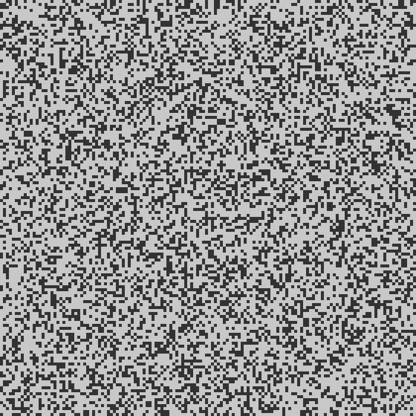

## Problem Intro

We are in the printing department and need to help the Elves optimise their forklift operations to break through a wall. The warehouse is represented as a grid of paper rolls (`@`) and empty spaces (`.`).

Forklifts can only access a roll of paper if there are **fewer than 4 rolls** in the 8 adjacent positions (horizontal, vertical, and diagonal).

Example input:
```text
..@@.@@@@.
@@@.@.@.@@
@@@@@.@.@@
@.@@@@..@.
@@.@@@@.@@
.@@@@@@@.@
.@.@.@.@@@
@.@@@.@@@@
.@@@@@@@@.
@.@.@@@.@.
```

## Part 1

**How many rolls of paper can be accessed by a forklift?**

I implemented a `ForkliftGrid` class to encapsulate the grid logic. Creating a dedicated class for the grid is a great practice because it keeps all the grid-related operations (like bounds checking and accessing values) in one place, making the main logic cleaner and easier to read.

The grid data is initialized by converting the input list of strings into a **list of lists**.

```python
class ForkliftGrid():
    def __init__(self, grid_array: list) -> None:
        self.array = [list(row) for row in grid_array]
        self._width = len(self.array[0])
        self._height = len(self.array)
```

Why lists instead of strings? In Python, strings are **immutable**, meaning they cannot be changed after creation. In Part 2, we need to "remove" paper rolls from the grid. If we stored the grid as strings, we would have to create a new string for every row we modify, which is inefficient. By using a list of lists, we can modify individual cells in-place (e.g., `self.array[y][x] = '.'`).

To represent coordinates, I used a `NamedTuple` called `Point`. This is a lightweight and immutable way to store `x` and `y` coordinates, which makes them perfect for dictionary keys or set members if needed.

```python
class Point(NamedTuple):
    x: int
    y: int

    def yield_neighbors(self):
        for dx in (-1, 0, 1):
            for dy in (-1, 0, 1):
                if dx == 0 and dy == 0:
                    continue
                yield Point(self.x + dx, self.y + dy)
```

I also used a **generator** for the `yield_neighbors` method. Instead of creating and returning a full list of neighbor points at once, `yield` produces them one by one. This is memory efficient and allows us to iterate over neighbors immediately.

The solution iterates through every point in the grid. If the point contains a paper roll (`@`), it checks its 8 neighbors using the generator. If the count of neighbors containing `@` is less than 4, the roll is counted as accessible.

## Part 2

**How many rolls of paper can be removed by iteratively removing accessible rolls?**

The process is iterative. Once accessible rolls are removed, *new* rolls might become accessible. We need to simulate the process of removing accessible rolls until no more rolls can be removed, and count the total number of rolls removed.

I used a `while` loop to repeatedly find accessible locations:
1.  Find all currently accessible rolls using the logic from Part 1.
2.  If no rolls are accessible, terminate.
3.  Mark all accessible rolls as removed.
4.  Increment the count of removed rolls.
5.  Repeat.

## Results

| Part | Result | Time |
| :--- | :--- | :--- |
| Part 1 | 1578 | 0.031s |
| Part 2 | 10132 | 0.732s |

*Note: Execution time for Part 2 is without visualisation generation.*

## Bonus: Visualisation

I created a visualisation using `Pillow` and `imageio` to generate a GIF of the process.

### Implementation Details

I implemented a `Visualiser` class that handles the image generation. It works by:

1.  **Initialization**: Takes the `ForkliftGrid` and a `scale` factor (pixels per grid cell).
2.  **Rendering Frames**: The `render_frame` method creates a new image using `PIL.Image.new`. It then iterates over the grid, drawing a rectangle for each cell using `PIL.ImageDraw`.
    *   Paper rolls (`@`) are drawn in light gray.
    *   Empty space (`.`) is drawn in dark gray.
    *   Removed rolls (`X`) are drawn in red (before disappearing).
3.  **Saving GIF**: The `save_gif` method uses `imageio` to stitch the collected frames into an animated GIF.

```python
    def render_frame(self):
        """ Render the current grid state to an image frame """
        img = Image.new("RGB", (self.grid.width * self.scale, self.grid.height * self.scale), "black")
        draw = ImageDraw.Draw(img)
        
        for y, row in enumerate(self.grid.array):
            for x, cell in enumerate(row):
                color = self.colors.get(cell, (0, 0, 0))
                draw.rectangle(
                    [x * self.scale, y * self.scale, (x + 1) * self.scale - 1, (y + 1) * self.scale - 1],
                    fill=color
                )
        self.frames.append(img)
```

### Optimization

Generating the GIF adds significant overhead. To avoid slowing down every run, I added a check to only run the visualisation logic if the output GIF file **does not already exist**.

```python
    # Only run visualisation if the output file doesn't already exist    
    if vis_filename:
        vis_path = locations.output_dir / vis_filename
        if not os.path.exists(vis_path):
            vis = Visualiser(grid, scale=5)
            vis.render_frame() # Initial state
```

This allows the solution to run in **~0.7s** normally, versus **~2.6s** when generating the visualisation.


